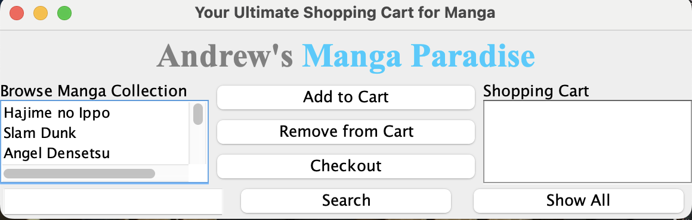
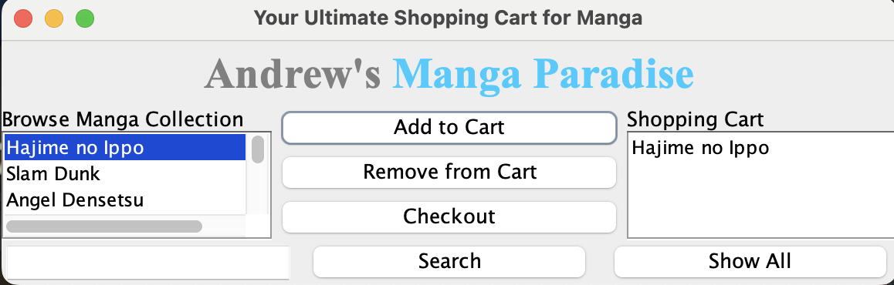
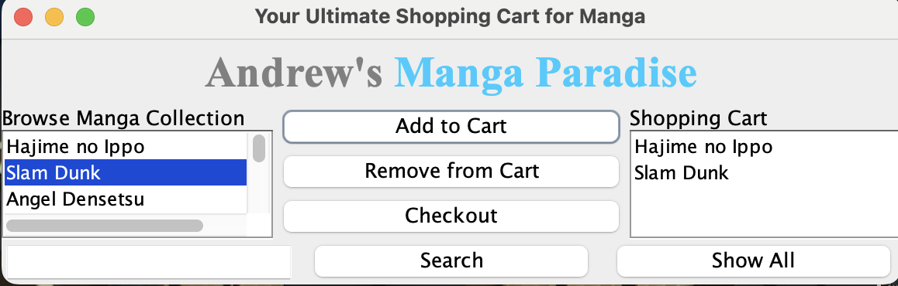
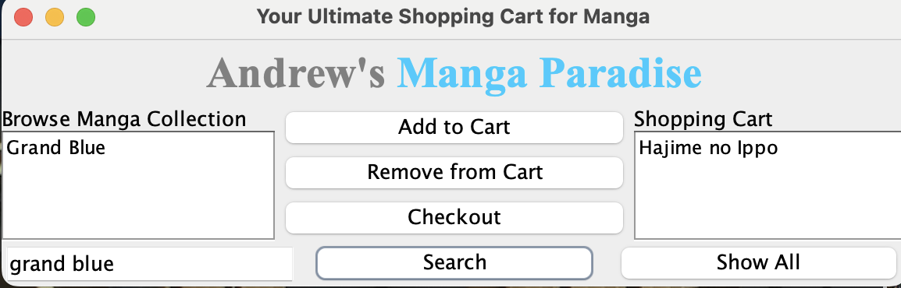
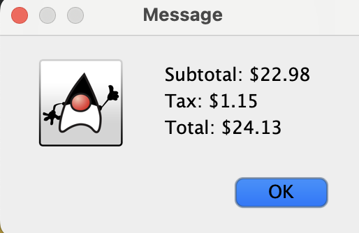

# OOPFinal Andrew's Manga Paradise
Andrew Sebastian Sibuea - 2602169711

Link to my google docs (report/documentation):
https://docs.google.com/document/d/1N8yu7MNfWNiNYea2AIeWDKRT-9hr8hHLb0q2XqVKEbI/edit

Link to the demo video:
https://drive.google.com/file/d/1D0rLfFA8sEGmZQ7xaIH2m53_LubA6kcZ/view?usp=sharing

## Brief description of the application:
“Andrew’s Manga Paradise” is an online manga store management application designed to provide users with a seamless and enjoyable shopping experience. With its intuitive graphical user interface, manga enthusiasts can easily explore and purchase their favorite manga titles. The program allows users to browse through an extensive collection of manga titles, organized in a user-friendly manner. Users can search for the specific manga, filter by genre or author, and access detailed information about each title, including summaries, ratings, and reviews. Once users have found their desired manga, they can conveniently add them to their shopping cart with a simple click. The program keeps track of the selected manga and provides an overview of the items in the cart, including their prices and quantities. To enhance user satisfaction, Andrew’s Manga Paradise also offers a secure and streamlined checkout process. Users can review their cart, make modifications if necessary, and proceed to the payment page. The program supports various payment methods, ensuring flexibility for users.

Overall, the application “Andrew’s Manga Paradise” aims to provide manga enthusiasts with a convenient and immersive platform to discover, explore, and purchase their favorite manga titles. Its user-friendly interface, extensive collection, secure checkout process, and personalized features contribute to an engaging and satisfying online shopping experience for manga lovers.

## Screenshots

